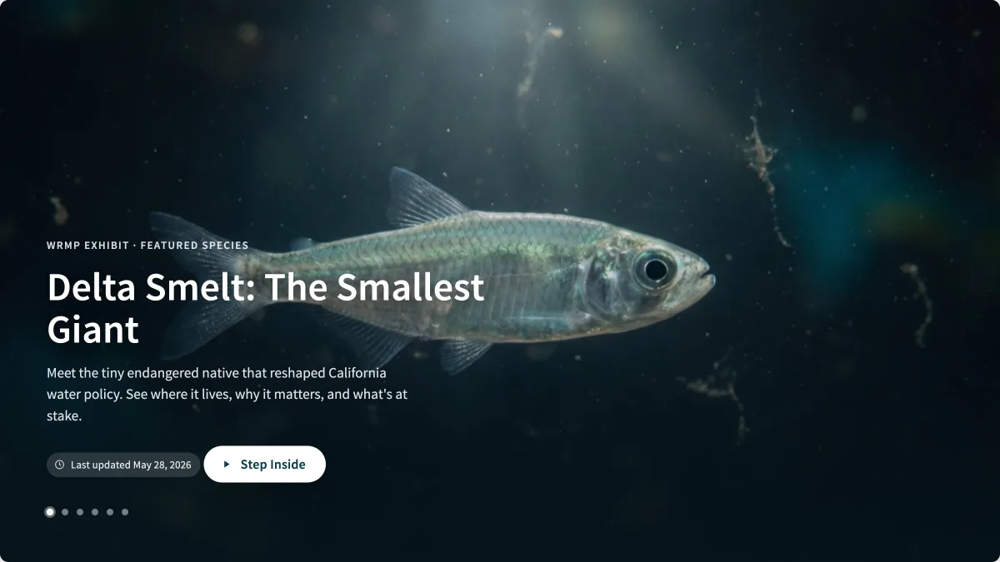
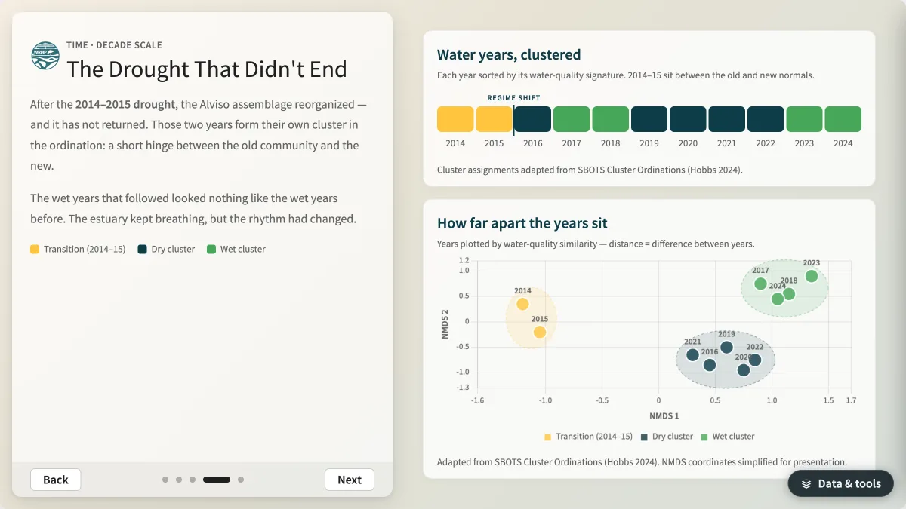
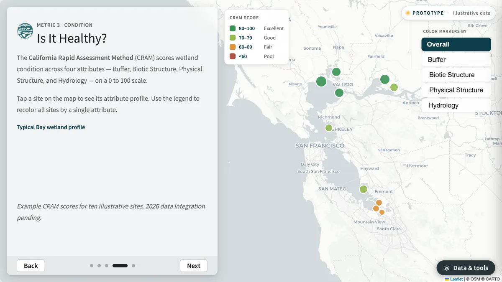
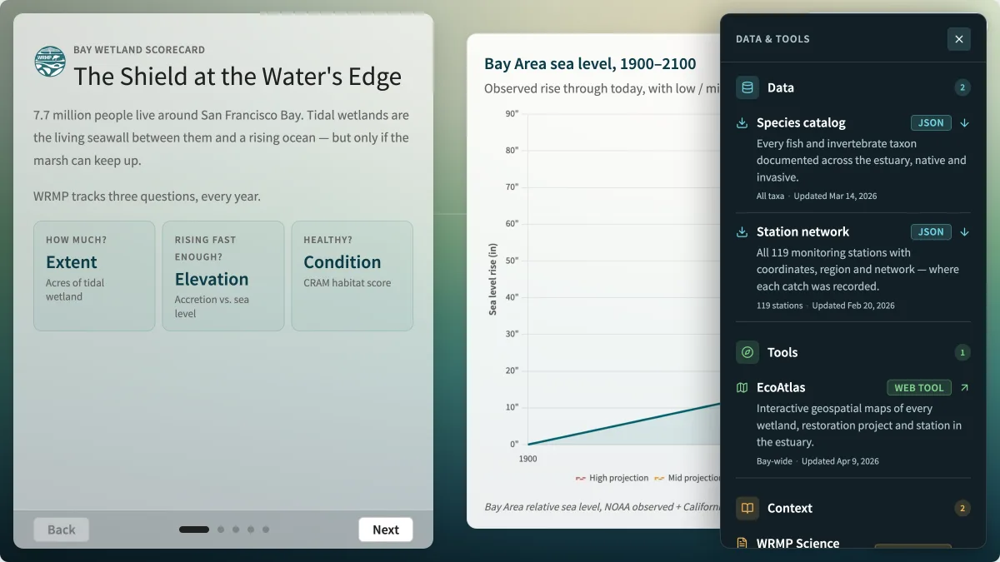

# Anatomy of an Exhibit

### How — and why — we build the WRMP's interactive exhibits

## Introduction

The WRMP holds a remarkable record of the San Francisco Estuary — years of fish,
habitat, and water-quality monitoring across a shifting, living system. These
interactive exhibits are how that record gets *told*: how a monitoring dataset
becomes something a curious person will choose to explore, and leave understanding
something they didn't before.

Every exhibit follows the same outline. This document explains the approach, walks
through that outline step by step, and shows it applied — to the exhibits already
built and to a few that could be.

---

## Exhibits, Not Dashboards

The approach follows the tradition of the natural history museum exhibition rather
than the analytics dashboard. The distinction matters, because the two forms have
opposite instincts.

A **dashboard** is built for the expert who already knows what they're looking
for. It maximizes access — every metric, every filter, every cut of the data,
available at once. It answers questions. It assumes a question.

An **exhibition** is built for the curious visitor who doesn't yet know what's
interesting. It makes a choice on the visitor's behalf — *this, here, is worth
your attention, and here is why.* It doesn't wait to be queried; it leads. A great
aquarium doesn't hand you a database of every fish in the bay and a set of filters.
It builds the kelp forest, puts you inside it, and lets the story of that ecosystem
unfold as you move through it.

Monitoring data is almost always presented as a dashboard. The WRMP's data earns
the exhibition treatment, because it is a genuinely dramatic multi-year story: a
drought that reset a fish community, restored marshes racing sea level rise, a few
species that drive an entire estuary. The queryable record matters too, and it
stays available — but the *first* encounter, for a board member, a partner, a
journalist, or a member of the public, should be a story, not a search box.

---

## Start With One Idea

The governing discipline is subtraction. **Each exhibit makes one point.** Before
anything is designed, we name the single sentence a visitor should carry away —
then include only what earns that sentence.

| Exhibit | The one idea it carries |
|---|---|
| A Decade in Alviso Marsh | A single drought reset the marsh's fish community from native- to non-native-dominated. |
| Native vs. Invasive | You can watch that shift happen — year by year, species by species. |
| Is the Bay Keeping Up? | Restored marshes are gaining ground in their race against sea level rise. |
| Designing the Experiment | Restoration is a designed experiment, with benchmark sites and project sites read against each other. |
| How We Monitor | Different gear catches different fish — which is why the program uses several. |

This is also why some results appear in forms that aren't the obvious ones. The
most faithful chart is rarely the most legible, and the most comprehensive view is
rarely the most memorable. A fourteen-year time series can be drawn as a forest of
lines, or as the single tipping point those lines actually describe — and the
tipping point is what a visitor remembers. We choose the view that makes the point
*land*, and we trade completeness for clarity in the narrative.

We can afford that trade because nothing is hidden. Every exhibit carries a quiet
**"data and tools" panel** — the full datasets, the source tools, the wider
context — one step behind the story, for anyone who wants to go past the narrative
and into the evidence.

---

## Exhibit Outline

With the one idea chosen, every exhibit carries it through the same five steps.
This is the blueprint — the part to follow when building a new one.

### Hook

**What it is.** The opening moment, and a way in that isn't a chart. Its only job
is to earn the next thirty seconds.

**Examples.** *Delta Smelt* opens on a slow, full-screen film of the fish itself.
*A Decade in Alviso Marsh* opens on an aerial of the marsh at dawn. A species
exhibit can open on a single number — "seven species, ninety percent of the catch."

**Best practices.**
- Lead with the subject, not the data — an image, a motion, or one arresting fact.
- One hook, not three. A second competing element weakens the first.
- Keep words minimal over the hook; let it do the pulling.

### Stakes

**What it is.** Why this matters, established *before* any data appears. It gives
the visitor a reason to care about the numbers that follow.

**Examples.** *Delta Smelt* — a native fish that reshaped California water policy,
now near extinction. *Is the Bay Keeping Up?* — tidal marshes are the region's
living seawall, but only if they can rise as fast as the sea.

**Best practices.**
- State the stakes in human or ecological terms, not statistical ones.
- Keep it to a sentence or two — the stakes set up the evidence, they aren't the evidence.
- An exhibit that feels flat is almost always missing the hook or the stakes.

### Stage

**What it is.** The single interactive surface that carries the evidence — a map, a
chart, or media — filling the frame. The narration is an overlay on it, not a
sidebar beside it.

**Examples.** The station map in *The Bay: Where We're Watching*. The condition map
in *Is the Bay Keeping Up?*. The clustered water-year chart in *A Decade in Alviso
Marsh*.

**Best practices.**
- One stage per exhibit — don't split the visitor's attention between two surfaces.
- The stage fills the frame; text floats over it rather than crowding it aside.
- The stage responds to the narration — it changes as the visitor advances.

### Reveal

**What it is.** A short, stepped sequence that uncovers the data one move at a
time, leading the visitor *through* the finding rather than handing them a control
panel to assemble it themselves.

**Examples.** *Native vs. Invasive* moves from "The Home Team" to "The Uninvited"
to "Where They Meet" to "Counting the Balance." *How We Monitor* walks one gear
type at a time — otter trawl, beach seine, gill net.

**Best practices.**
- Four to six steps, not twelve. Each step is one idea.
- Every step changes the stage — a new step that doesn't move the visual is a
  paragraph, not a step.
- Keep forward momentum; each step should feel like progress toward the point.

### Payoff

**What it is.** The point landing — and then a graceful handoff to depth for anyone
who wants more.

**Examples.** *A Decade in Alviso Marsh* closes on "Why This Shape of Program?".
*Delta Smelt* closes on "You Can't Save What You Can't See." Every exhibit ends
with the data and tools panel and a path to related exhibits.

**Best practices.**
- Restate the one idea in plain terms — the visitor should be able to repeat it.
- Offer a next step: deeper data, a related exhibit, a way to act.
- Don't end abruptly; the payoff is the moment the exhibit earns its keep.

---

## Interactive Elements

Most of the time, the narration leads and the stage responds — the visitor reads,
and the map or chart changes beneath the words. The interaction is *exploration in
service of the story*, and keeping it that way is what makes an exhibit feel
composed rather than operated.

Occasionally, though, the point itself is something a visitor grasps best by
working it with their own hands. Wetland condition, as measured by the California
Rapid Assessment Method (CRAM), is not a single number — it's several dimensions of
habitat health rolled into one score. You can *tell* someone that, or you can let
them recolor every site by a single attribute and watch the picture change. The
second teaches what the first only asserts.

So we put an interactive control into the narrative itself when three things are
true:

1. **Manipulating it teaches** — the idea is genuinely multi-dimensional, and
   handling it *is* the explanation.
2. **The control is small and legible** — a toggle, a short set of choices, not a form.
3. **It stays optional** — the story still reads start to finish for a visitor who
   never touches it.

When those conditions don't hold, the interaction belongs on the stage — filtering
the map, scrubbing the timeline — not in the narration. Making every panel
interactive by default would quietly turn the exhibit back into the dashboard we
set out not to build.

---

## External Data

The WRMP's own monitoring is the protagonist of every exhibit; it answers *what we
have observed.* But some of the most important questions are *why* and *compared to
what* — and those answers often live outside the program's own measurements.

We reach for external data in three situations:

- **To supply the driver** behind a WRMP signal — the drought severity behind a
  community shift, the rate of sea level rise a marsh is racing. Pairing the
  program's observations with outside data on external drivers is built into the
  WRMP's own science framework, which calls for exactly this.
- **To set a baseline** the program is too young to provide itself — the regional
  and historical context that situates a finding.
- **To offer a tool, not a claim** — a shared map or reference a visitor can carry
  onward into their own work.

Three rules keep external data in its proper, supporting role:

- It is always **attributed and dated**, so its provenance is visible.
- It **frames or explains** the WRMP finding; it never *becomes* the finding.
- We **point to it rather than reproduce it**, so authority stays with its source
  and the exhibit stays current.

The moment an outside number appears inside an exhibit, it carries the program's
credibility. So the bar for including it is the same bar the WRMP sets for its own
data.

---

## Current Exhibits

The exhibits built to this outline, for reference. Each link opens the live
exhibit; beneath it, the same five steps, filled in. The steps are the underlying
structure, not on-screen labels — the Hook and Stakes live in the opening, the
Stage is the surface every step shares, the Reveal is the stepped middle, and the
Payoff is the close.

#### [The Bay: Where We're Watching](exhibits/round-3-2026-06/station-map-stepper/index.html)

The monitoring network across the estuary.

- **Hook** — the estuary seen whole, from above.
- **Stakes** — you can't read a system you haven't mapped; where you watch shapes what you learn.
- **Stage** — the station map of the entire bay.
- **Reveal** — the estuary's three regions → the monitoring network → restoration in progress.
- **Payoff** — what the network will watch next.

#### [Delta Smelt: The Smallest Giant](exhibits/round-3-2026-06/delta-smelt/index.html)

A featured-species profile of an endangered native.

- **Hook** — meet the smallest giant, on film.
- **Stakes** — a tiny native that reshaped California water policy, now near extinction.
- **Stage** — a video hero giving way to the species' range map.
- **Reveal** — this is its world → who shares this water → a species under pressure → the network that watches.
- **Payoff** — you can't save what you can't see.

#### [How We Monitor](exhibits/round-3-2026-06/how-we-look/index.html)

Why no single net catches the whole community.

- **Hook** — no single net catches everything.
- **Stakes** — what you catch depends on how you fish; gear choice shapes the record.
- **Stage** — field photography of each gear type at work.
- **Reveal** — otter trawls → beach seines → gill nets & fyke traps, each catching a different slice.
- **Payoff** — matching tools to questions.

#### [Native vs. Invasive](exhibits/round-3-2026-06/native-vs-invasive/index.html)

The shifting balance of native and non-native species.

- **Hook** — 237 species call it home.
- **Stakes** — which ones belong, and whether the balance is tipping.
- **Stage** — the species-composition timeline over the map.
- **Reveal** — the home team → the uninvited → where they meet.
- **Payoff** — counting the balance.

#### [Designing the Experiment](exhibits/round-3-2026-06/restoration-network/index.html)

Restoration as a designed experiment.

- **Hook** — restoration as a designed experiment.
- **Stakes** — you only learn whether restoration works if the comparison is built in from the start.
- **Stage** — the site-network map: benchmark, reference, and project sites.
- **Reveal** — benchmarks (the gold standard) → reference sites → project sites.
- **Payoff** — what comes next, and the full picture.

#### [A Decade in Alviso Marsh](exhibits/round-3-2026-06/alviso-decade/index.html)

Fourteen years of monitoring and a drought-driven regime shift.

- **Hook** — the marsh as a living laboratory at the bay's edge.
- **Stakes** — what fourteen years reveal that a single survey can't.
- **Stage** — the SBOTS charts: time series and water-year clustering.
- **Reveal** — the salinity gradient → two seasons, not four → the drought that didn't end.
- **Payoff** — why the program is shaped the way it is.

#### [Is the Bay Keeping Up?](exhibits/round-3-2026-06/bay-keeping-up/index.html)

Whether restored marshes can outpace sea level rise.

- **Hook** — the marsh as the shield at the water's edge.
- **Stakes** — the living seawall only works if it rises as fast as the sea.
- **Stage** — the condition and extent map, and the scorecard gauges.
- **Reveal** — how much wetland is left → is it rising fast enough → is it healthy (CRAM).
- **Payoff** — the bay's report card.
